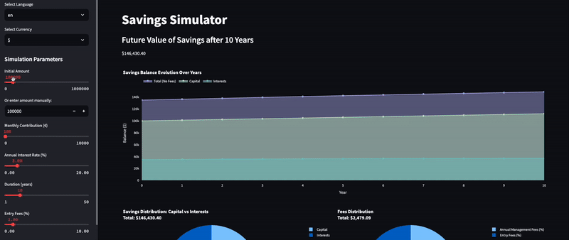

# Savings Simulator

<p align="center">
   <a href="https://twitter.com/cz_antoine"></a>
   <a href="https://www.linkedin.com/in/antoine-cichowicz-837575b1"></a>
   <a href="https://github.com/czantoine/Savings-Simulator"></a>
</p>


## Access the Application

You can access the **Savings Simulator** online without needing to deploy it locally. Visit the following link to use the application:

[**Savings Simulator**](https://savingssimulator.streamlit.app/)

## Description

The **Savings Simulator** is a web application built with Streamlit that helps users visualize the future value of their savings over time. The app allows users to input various parameters, including initial amount, monthly contributions, annual interest rate, duration, entry fees, and management fees, to simulate and visualize how their savings will grow.



## Features

- **Interactive UI:** Users can adjust simulation parameters using sliders and input fields.
- **Dynamic Charts:** Visualize savings balance evolution, fees distribution, and capital vs. interests.
- **Multi-language Support:** Available in English and French.
- **Currency Selection:** Support for multiple currencies.

## Getting Started

1. **Application deployment:**

   ```bash
   git clone https://github.com/yourusername/savings-simulator.git
   cd savings-simulator
   python3 -m venv venv
   source venv/bin/activate # .\venv\Scripts\activate for Windows
   pip install -r requirements.txt
   streamlit run savings_simulator.py
   ```

## Security

See [CONTRIBUTING](CONTRIBUTING.md#security-issue-notifications) for more information.

## License

This repository is licensed under the Apache License 2.0 - [LICENSE](LICENSE) file for details.

---

If you find this project useful, please give it a star ⭐️ ! Your support is greatly appreciated. Also, feel free to contribute to this project. All contributions, whether bug fixes, improvements, or new features, are welcome!